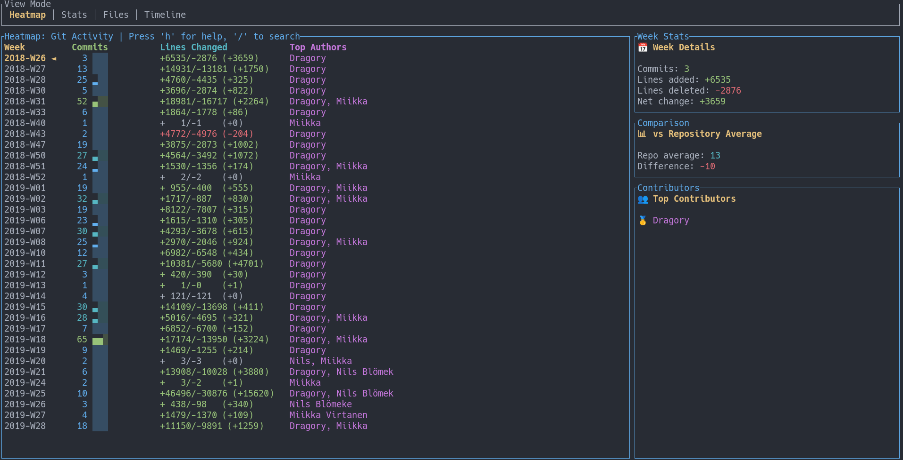

# gmap

> A fast CLI tool to explore Git activity — churn, heatmaps, authorship, and more.

[](https://crates.io/crates/gmap)
[](LICENSE)

---

## Installation

```sh
cargo install gmap
````

---

## Usage

```sh
gmap <SUBCOMMAND> [OPTIONS]
```

---

## Usage

```sh
Usage: gmap [OPTIONS] <COMMAND>

Commands:
  churn
  heat
  export
  help    Print this message or the help of the given subcommand(s)

Options:
      --repo <REPO>     Path to git repository
      --cache <CACHE>   Path to cache database
      --include-merges  Include merge commits
      --binary          Include binary files
      --since <SINCE>   Start from this commit or date (RFC3339, YYYY-MM-DD, or natural language)
      --until <UNTIL>   End at this commit or date (RFC3339, YYYY-MM-DD, or natural language)
  -h, --help            Print help
  -V, --version         Print version
```

## TUI Mode

Launch the terminal UI:
```bash
gmap heat --tui
```

Keybindings:

* `← →` Navigate views
* `/` Search
* `Esc` Exit search
* `Tab` Switch view
* `h` Help overlay

---

## Screenshot



---